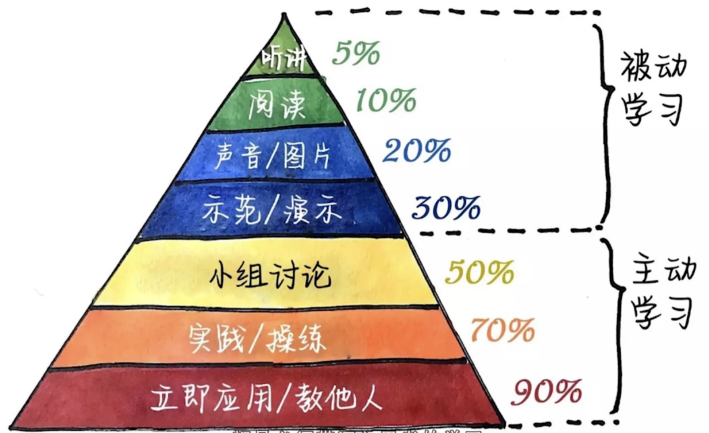

# 如何做笔记

## 记笔记的意义

减小记忆负担，从而能进行深入思考

好的笔记是帮助思考的工具

## 如何思考

一眼望穿（知识结构）想关系（知识点之间的关系，知识与现实的关系），时刻都问为什么（做自我提问）

## 如何记笔记

1. 信息输入的时候记关联性笔记
   1. 实时思考知识点之间的关联和知识点的应用
   2. 记关键词和关键词的关系
      1. 空雨伞笔记法：知识的分类（参考布鲁姆分类法中知识的分类）
         1. 把一页纸分成三个区，从做到右依次记录事实性知识、概念性知识、程序性知识和元认知
         2. 空雨伞笔记法也就是 what、why、how
      2. 笔记流笔记法：知识的联系
         1. 尽量用很短的词代替完整的句子
