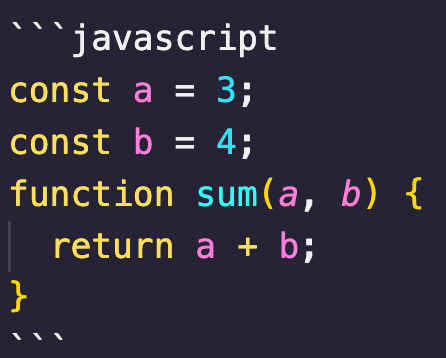

# Markdown 用法大全

参考文档：

- https://blog.csdn.net/heimu24/article/details/81189700
- https://blog.csdn.net/qcx321/article/details/53780672
- https://www.jianshu.com/p/ebe52d2d468f
- 颜色对照表：https://blog.csdn.net/heimu24/article/details/81192697

## markdown 和 HTML 的关系

HTML 是一种发布格式，Markdown 是一种创作格式。
所以，对于 Markdown 中未包含的标签, 可以直接使用 HTML 标签

## 文字和颜色：

```
&emsp;&emsp;段落从此开始。

(其中：&emsp;或&#8195;//全角
 &ensp;或&#8194;//半角
 &nbsp;或&#160;//半角之半角)


这里有个&nbsp;空格

**粗体**

_斜体_

***加粗斜体***

~~删除线~~

<font face="黑体">我是黑体字</font>

<font face="STCAIYUN">我是华文彩云</font>

<font color=red>我是红色</font>

<font color=#008000>我是绿色</font>

<font size=5>我是尺寸</font>

<font face="黑体" color=green size=5>我是黑体，绿色，尺寸为 5</font>

<table><tr><td bgcolor=yellow>添加背景色，由于 style 标签和标签的 style 属性不被支持，所以这里只能是借助 table, tr, td 等表格标签的 bgcolor 属性来实现背景色。故这里对于文字背景色的设置，只是将那一整行看作一个表格，更改了那个格子的背景色（bgcolor）</td></tr></table>


```

&emsp;&emsp;段落缩进

这里有个&nbsp;空格

**粗体**

_斜体_

**_加粗斜体_**

~~删除线~~

<font face="黑体">我是黑体字</font>

<font face="STCAIYUN">我是华文彩云</font>

<font color=red>我是红色</font>

<font color=#008000>我是绿色</font>

<font size=5>5 寸大小的字</font>

<font face="黑体" color=green size=5>我是黑体，绿色，尺寸为 5</font>

## <table><tr><td bgcolor=yellow>添加背景色，由于 style 标签和标签的 style 属性不被支持，所以这里只能是借助 table, tr, td 等表格标签的 bgcolor 属性来实现背景色。故这里对于文字背景色的设置，只是将那一整行看作一个表格，更改了那个格子的背景色（bgcolor）</td></tr></table>

---

## 插入图片：

```

```


### 设置图片大小：

```

```


```

```


### 设置图片位置：center、left、right

```
<div align=center></div>
```

<div align=center></div>

### 图片超链

```

```


---

## 符号和标记

### 分割线：

```
// 需要单独成行
---
```

---

### 引用：

```
> 这是引用符号
```

> 这是引用符号

```
> 这是引用符号
>> 引用中的引用
```

> 这是引用符号
>
> > 引用中的引用

---

## 标题

```
// 一级标题自带下划线

# 一级标题
## 二级标题
### 三级标题
#### 四级标题
##### 五级标题
###### 六级标题
```

# 一级标题

## 二级标题

### 三级标题

#### 四级标题

##### 五级标题

###### 六级标题

---

## 列表

### 无序列表

```
// 使用tab缩进

- 内容 1
  - 内容1-1
- 内容 2
  - 内容2-1
  - 内容2-2
    - 内容2-2-1
    - 内容2-2-2
- 内容 3
```

- 内容 1
  - 内容 1-1
- 内容 2
  - 内容 2-1
  - 内容 2-2
    - 内容 2-2-1
    - 内容 2-2-2
- 内容 3

### 有序列表

```
1. 内容1
   1. 内容1-1
      1. 内容1-1-1
      2. 内容1-1-2
   2. 内容1-2
   3. 内容1-3
2. 内容2
3. 内容3
```

1. 内容 1
   1. 内容 1-1
      1. 内容 1-1-1
      2. 内容 1-1-2
   2. 内容 1-2
   3. 内容 1-3
2. 内容 2
3. 内容 3

### 待办列表

```
- [ ] 任务一 未做任务
- [x] 任务二 已做任务
```

- [ ] 任务一 未做任务
- [x] 任务二 已做任务

---

## 超链接

### 隐藏网址：

[]里写链接文字，()里写链接地址, ()中的""中可以为链接指定 title 属性，title 属性可加可不加。title 属性的效果是鼠标悬停在链接上会出现指定的 title 文字，链接地址与 title 中间有一个空格。

```
[关当当的博客](https://guanxiaodan.github.io/ "关当当的博客")
```

[关当当的博客](https://guanxiaodan.github.io/ "关当当的博客")

### 参考式：

参考式超链接一般用在学术论文上面，或者另一种情况，如果某一个链接在文章中多处使用，那么使用引用 的方式创建链接将非常好，它可以让你对链接进行统一的管理。

```

我经常去的几个网站[Google][1]、[Leanote][2]。

[1]: http://www.google.com
[2]: http://www.leanote.com
```

我经常去的几个网站[Google][1]、[Leanote][2]。

[1]: http://www.google.com
[2]: http://www.leanote.com

<!-- ### 注脚：

目前不生效，不知道为啥
在需要添加注脚的文字后加上脚注名字[^注脚名字],称为加注。 然后在文本的任意位置(一般在最后)添加脚注，脚注前必须有对应的脚注名字。

注意：注脚与注脚之间必须空一行，不然会失效。成功后会发现，即使你没有把注脚写在文末，经 Markdown 转换后，也会自动归类到文章的最后。

使用 Markdown[^ma]可以效率的书写文档, 直接转换成 HTML[^mp]。

[^ma]: Markdown 是一种纯文本标记语言

[^mp]: HyperText Markup Language 超文本标记语言 -->

### 页内超链接-锚点

只支持在标题后插入锚点，其它地方无效。

```
[如何设置图片大小](#设置图片大小)
```

[如何设置图片大小](#设置图片大小)

### 直接放链接

```
<http://ibruce.info>

<1234567@163.com>
```

<https://guanxiaodan.github.io/>

<1234567@163.com>

---

## 代码块

### 方式一：

````javascript
// ```指定语言类型（非必须）

```javascript
        const a = 3
        const b = 4
        function sum(a,b){
            return a+b
        }
    ```;
````



```javascript
const a = 3;
const b = 4;
function sum(a, b) {
  return a + b;
}
```

### 方式二：前面加 4 个空格或 1 个 Tab

```
    const a = 3;
    const b = 4;
    function sum(a, b) {
        return a + b;
    }
```

    const a = 3;
    const b = 4;
    function sum(a, b) {
        return a + b;
    }

### 注释

注释只会在 md 文件中显示，不会被编译出来，所以看不到，复制下面试一下就明白了

```
<!-- 注释 -->
```

## <!-- 注释 -->

## 转义字符

```
\\ 反斜杠

\` 反引号

\* 星号

\_ 下划线

\{\} 大括号

\[\] 中括号

\(\) 小括号

\# 井号

\+ 加号

\- 减号

\. 英文句号

\! 感叹号
```

\\ 反斜杠

\` 反引号

\* 星号

\_ 下划线

\{\} 大括号

\[\] 中括号

\(\) 小括号

\# 井号

\+ 加号

\- 减号

\. 英文句号

\! 感叹号

### 特殊符号:

| 符号 |   含义   |      写法 |
| ---- | :------: | --------: |
| <    |  小于号  |     \&lt; |
| >    |  大于号  |     \&gt; |
| &    |    和    |    \&amp; |
| ￥   |  人民币  |    \&yen; |
| ©    |   版权   |   \&copy; |
| ®    | 注册商标 |    \&reg; |
| °C   |  摄氏度  |   \&deg;C |
| ±    |  正负号  | \&plusmn; |
| ×    |   乘号   |  \&times; |
| ÷    |   除号   | \&divide; |
| ²    |   平方   |   \&sup2; |

---

## 表格

### 方式一：

```
| Tables        | Are           | Cool  |
| ------------- |:-------------:| -----:|
| col 3 is      | right-aligned | $1600 |
| col 2 is      | centered      |   $12 |
| zebra stripes | are neat      |    $1 |

```

| Tables        |      Are      |  Cool |
| ------------- | :-----------: | ----: |
| col 3 is      | right-aligned | $1600 |
| col 2 is      |   centered    |   $12 |
| zebra stripes |   are neat    |    $1 |

### 方式二

```
项目     | 价格
-------- | ---
Computer | $1600
Phone    | $12
Pipe     | $1
```

| 项目     | 价格  |
| -------- | ----- |
| Computer | $1600 |
| Phone    | $12   |
| Pipe     | $1    |

## 快捷键
