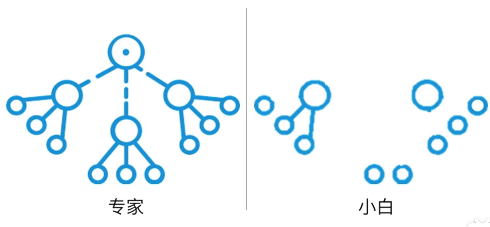

# 知识迁移（如何使用学到的知识）

## 怎样把知识用起来

### 问题的三个主要组成部分：

1. 目标：希望达到的最终状态
2. 已知信息:从问题中可以得到的各种信息，比如背景信息和条件
3. 操作：为了达到目标而采取的行动

如果以上信息都比较全面和清晰，那就是一个结构良好的问题，反之就是结构不良的问题

### 如何应对结构不良问题：

1. 分析问题的结构，明确问题的目标
2. 筛选重要的信息
   1. 哪些问题与解决问题有关，哪些问题无关紧要
   2. 与解决方案有关的内容都是怎么联系在一起的
3. 进行问题界定来选取最合适的解决方案，这时候需要用到问题图示

### 问题图示

用特定方法解决特定问题的知识

### 如何促进迁移的发生

1. 提高元认知能力
   1. 发现并界定问题：尝试发现问题并用已有的问题图示来界定问题，从而达到锻炼迁移能力的目的
   2. 注重分析相似知识之间的差异
   3. 学习一般问题的解决策略，几重常见的普适性较强的策略：
      1. 头脑风暴法
         1. 遇到一个问题的时候大开脑洞，列出所有可能的解决方案，然后挑选出合适的
      2. 手段目的分析法：将整个问题拆分称一系列的子问题并各个击破
         1. 比如出去理由，第一件事就是办好护照和签证，第二买好来回的票，第三定具体安排和住处
      3. 逆推法
         1. 从目标开始反向推回初始条件，这样不至于面对问题的时候干瞪眼
      4. 类比法
         1. 用相似的手段解决相似的问题
2. 积累问题图示并完善图式结构
   1. 刻意练习迁移并积累问题图示
      1. 学习到一个新知识后创造使用它的条件，来帮助迁移知识使越来越自动化
   2. 增加图示的结构层次和复杂程度
3. 基于问题学习（PBL）
   1. 可以帮我们更好的迁移所学的知识，从一开始避免获取惰性知识
      1. 从实际情况入手去学习新知识，珍惜这些基于问题进行学习的机会，不要因为在学习中遇到困难就敷衍了事
