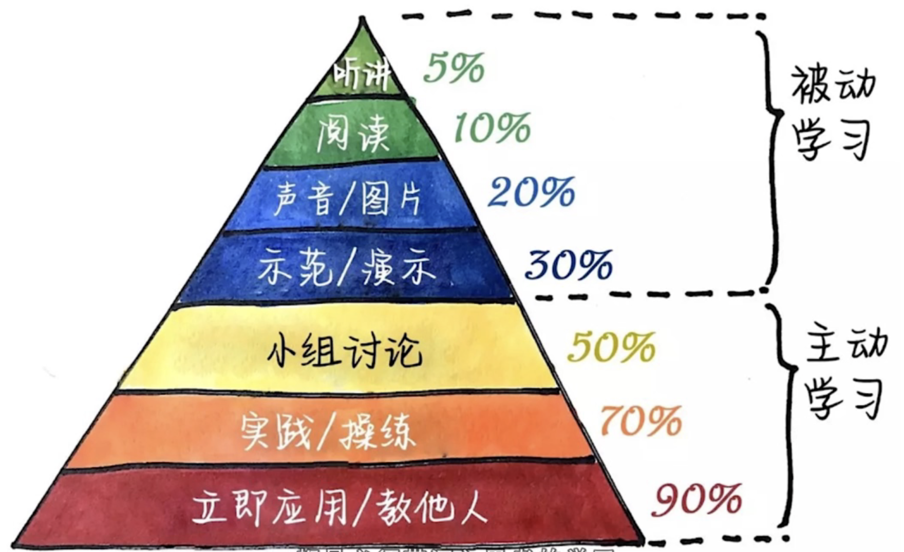

# 如何做笔记

## 记笔记的意义

减小记忆负担，从而能进行深入思考

好的笔记是帮助思考的工具

## 如何思考

一眼望穿（知识结构）想关系（知识点之间的关系，知识与现实的关系），时刻都问为什么（做自我提问）

## 如何记笔记

1. 信息输入的时候记关联性笔记
   1. 实时思考知识点之间的关联和知识点的应用
   2. 记关键词和关键词的关系
      1. 空雨伞笔记法：知识的分类（参考布鲁姆分类法中知识的分类）
         1. 把一页纸分成三个区，从做到右依次记录事实性知识、概念性知识、程序性知识和元认知
         2. 空雨伞笔记法也就是 what、why、how
      2. 笔记流笔记法：知识的联系
         1. 尽量用很短的词代替完整的句子
         2. 更多关注知识之间的关系
      3. 记录关系的形式
         1. 线性关系(箭头)
            1. 因果、影响、时间顺序
         2. 对比关系（图表）
            1. 异同、优劣、评价
         3. 层级关系（树状图）
            1. 结构层级、概念的包含关系
2. 反思性笔记
   1. 思考自己之前是怎么做的
   2. 思考做的过程是什么
   3. 做之后又有什么样的思考
   4. 记录日志
   5. 两个要点：
      1. 数据化：分类、整理、存档
      2. 复习笔记：回顾笔记，把整理好的笔记利用起来，用到实践中，并不断更新笔记，除陈增新。不整理和吻戏笔记，那笔记就跟没记一样
