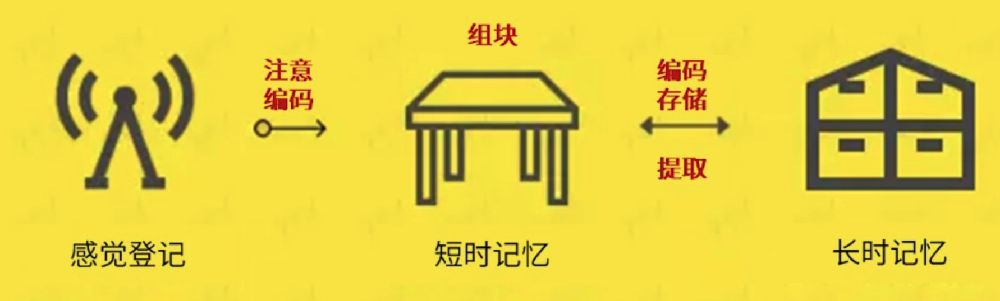

# 关于记忆

记忆术 ≠ 记忆

想要增强记忆，需要找到信息之间的关联，并创造意义、构建知识体系

## 记忆流水线

1. 感觉登记（瞬间记忆）
   1. 信息在感觉通道内迅速被登记并保留一瞬间的记忆
   2. 比如眼睛看到的内容，听到的声音等等，通常会保留几秒钟的时间
   3. 看到了也听到了，但是没过脑子，或没有意识到自己看到了听到了什么，这种就相当于没有进行感觉登记
2. 工作记忆（短时记忆）
   1. 对感觉登记进行加工，将记忆编码加工成有意义有关联的知识块，能保留十几秒到几分钟。想要保留这段记忆的方法就是不断复述
   2. 长时间的感觉登记，注意的重点不同，就会在工作记忆中留下完全不同的信息
   3. 比如同样看一个电影，普通用户看的是剧情，电影工作者看的是编剧结构，演绎手法，拍摄技巧等。
   4. 有一定的容量（工作记忆容量）
3. 长时记忆
   1. 将关联的记忆块存储在长时记忆区，存储时间可能是几天，也有可能是一辈子
   2. 越能和长时记忆中的片段建立关联，越容易记忆住新的信息
   3. 长时记忆的容量是无限的
   4. 长时记忆中的信息越多，越能记住新的东西。也就是常说的脑子越用越灵活
      

## 为什么会遗忘

> 谷歌效应：更多记忆的不是知识本身，而是获取到知识的路径

所以谷歌效应说明我们在学习的时候，要把更多的注意力放在知识本身 ，而不是去做大量的笔记。所以注意力的分配才是要点。

1. 编码过程
   1. 对知识问为什么的时候，知识加工效率最高
   2. 会遗忘说明在记忆的时候，对知识的编码程度加工程度不深，或者根本就没有加工。没有问是什么，为什么，怎么做/用
2. 提取
   1. 人们往往只能提取长时记忆的一部分，剩下的一部分是根据自己的信念进行的填补。所以最后提取出来的记忆时候可能会跟根据自我意识进行一定程度的篡改

## 记忆宝典

1. 变被动学习为主动学习
   1. 编码对记忆很重要，如何编码？
      1. 告诉自己这是自己想要学的知识，而不是被逼着学的知识
      2. 做到上面一点，才能主动地进行思考。要知道记忆不是死记硬背，而是帮助你理解知识。多问为什么，怎么办来帮助自己思考。问的越多，答得越多，记得也越好
   2. 善用已有的知识体系，加深新内容和已有知识的联系
   3. 增加记忆的提取次数
      1. 在学习的过程中，加入回忆和提取，反复进行编码加工环节，可以让知识点更加符合思维逻辑，这样也就记得更牢，提取记忆会更快捷和准确
